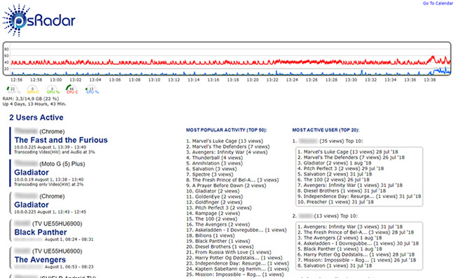
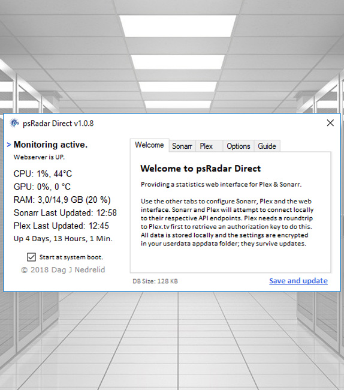
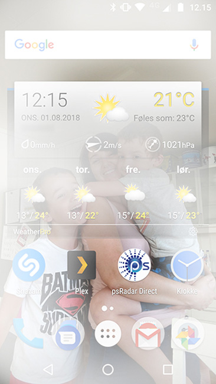
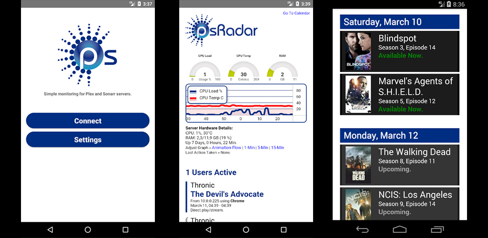

## psRadar Direct  

En Plex, Sonarr og HW monitor. Sist oppdatert i 2018 og regnes nå som arkivert.  
Program installeres på en Windows server med Plex og/eller Sonarr.  
Man kan deretter se aktivitet på Plex, og evt. gi Sonarr kalenderlenker til venner.  
   

  
  
  
  
   

**Beskrivelse på engelsk hentet fra gammel nettside:**  

Monitors Plex.tv and Sonarr.tv services via their local API.  
It also acts as a hardware monitor, including GPU statistics.

Only a few megabytes in an isolated application folder.  
No bloat (shared files, services or third-party software).  
A local URL is specified in the Guide page of the program.  

Big thanks and improvement credits to Nightwaker for extensive testing!  
   
   

**DISCLAIMER**  
This software IS NOT affiliated with Plex.tv or Sonarr.tv in ANY WAY.  
This software DOES NOT PROVIDE STREAMING, PLAYING OR DOWNLOADING OF MEDIA.  
This software is strictly a service-monitoring tool for Plex/Sonarr server managers.  
Users of this software are fully responsible for their own server(s) and their content.  